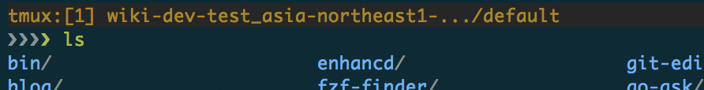

tmux-k8s-context-indicator
===

Like [zsh-kubectl-prompt](https://github.com/superbrothers/zsh-kubectl-prompt), but for [tmux](https://github.com/tmux/tmux/wiki)



## Usage

Download this repo and copy this script `kube-context` to your any PATH directory.

```console
$ git clone https://github.com/b4b4r07/tmux-k8s-context-indicator
$ chmod 755 bin/kube-context
$ cp bin/kube-context /usr/local/bin # $PATH as you like
```

then, you should modify your `.tmux.conf` like the following:

```tmux
set-option -g status-left 'tmux:[#P] #(kube-context --trim-prefix "gke_myproj-" --truncate-length 30)'
```

Finally, reload tmux.conf. That's all.

For more options, please run `kube-context --help`.

## License

MIT

## Author

b4b4r07